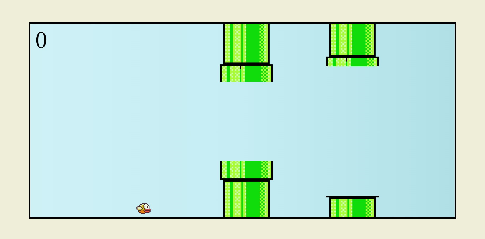

# Flappy Bird Game

  

> This is a simple implementation of the classic Flappy Bird game using HTML, CSS, and JavaScript.

## 🌟 Developed During

This project was developed as part of the "Curso Web Moderno Completo com JavaScript + Projetos" [course](https://www.udemy.com/course/curso-web/?couponCode=24T3MT53024) on Udemy.

## 🎮 Game Controls

- Press any key to make the bird jump and avoid the pipes.
- Navigate the bird through the pipes to earn points.

## 🕹️ How to Play

1. Open the `index.html` file in your web browser.
2. Press any key to start the game.
3. Use the spacebar or any key to make the bird jump.
4. Navigate the bird through the pipes.
5. Avoid collision with the pipes to stay alive.
6. Earn points for successfully passing through pipes.

## 📂 Game Structure

- **`index.html`**: HTML file defining the structure of the game.
- **`style.css`**: CSS file for styling the game elements.
- **`script.js`**: JavaScript file containing the game logic.
